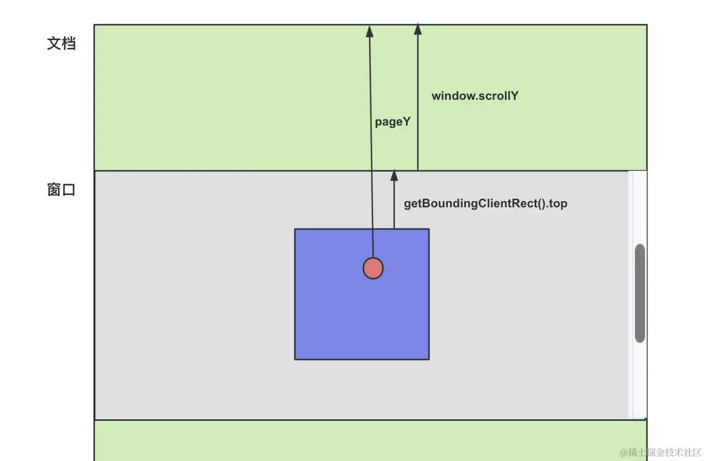
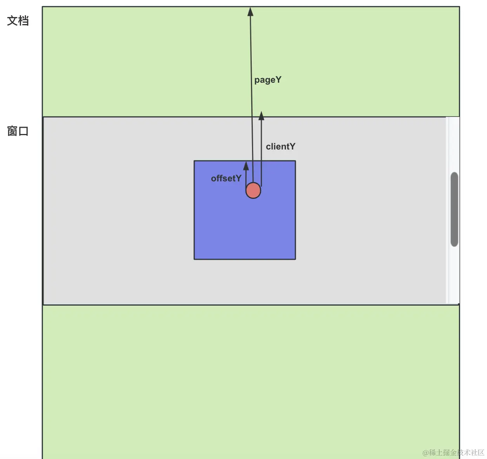

- pageY: 鼠标事件对象的一个属性，表示鼠标指针相对于整个文档的垂直位置（Y 轴坐标）。是一个全局坐标，相对于整个文档的顶部。
- clientY：表示鼠标指针相对于当前视口（浏览器窗口）的垂直位置（Y 轴坐标）。它不考虑页面的滚动距离，只关注当前视口内的位置。
- offsetY：表示鼠标指针相对于事件绑定元素（或其最近的定位父元素）的垂直位置（Y 轴坐标）。它通常用于处理鼠标在某个特定元素内的位置。
  - 在react中，react是合成事件，少了原生事件的属性，如offsetY，需要通过pageY - scrollY - getBoundingClientRect().top来获取 
    

- scrollTop: 可以用来获取一个元素内部内容在垂直方向上已经滚动的距离
- offsetTop: 相对于元素的 offsetParent 的顶部计算的。offsetParent 是最近的具有定位属性（position 不为 static）的祖先元素。如果没有这样的祖先元素，则 offsetParent 是 html 元素。
- clientTop: 一个元素顶部边框的宽度（以像素表示）
- scrollHeight: 元素内容高度的度量，包括由于溢出导致的视图中不可见内容
- clientHeight: 内容高度，不包括边框
- offsetHeight: 包含边框的高度
- element.getBoundingClientRect：拿到 width、height、top、left 属性，其中 top、left 是元素距离可视区域的距离，width、height 绝大多数情况下等同 offsetHeight、offsetWidth，但旋转之后就不一样了，拿到的是包围盒的宽高