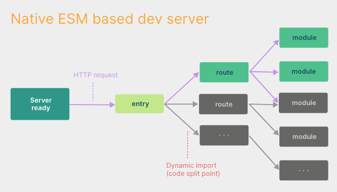

浏览器在支持模块化之前,打包是指构建工具会先处理源码并将其串联成可以在浏览器运行的文件,但是当构建的应用越来越大的时候,启动开发服务器或者是热更新都需要很长的时间.

因此基于打包的方式启动必须抓取并构建整个应用,然后才可以提供服务

###### Vite 将模块分为依赖和源码,来改进开发服务器启动时间

- 依赖: 大多数在开发的时候不会变动的纯 js 文件,vite 使用 esbuild 预构建依赖
- 源码: 包含一些不直接是 js 的文件,如 jsx,vue 等时常被编辑的文件,同时不是所有的源码都需要同时被加载

Vite 以原生 esm 的方式提供源码,就相当于浏览器接管了打包程序的部分工作,Vite 只需要在浏览器请求源码的时候进行转换,并按需提供源码

在 Vite 中.热更新是在原生的 ESM 上执行的,当编辑一个文件的时候,Vite 只需要精确的使已编辑的模块和最近的 HMR 边界失活,这样子无论应用大小如何,HMR 始终可以快速更新

Vite 同时会用 HTTP 来进行加速,源码模块进行协商缓存,依赖模块则进行强缓存

###### 生产环境仍然选择打包的原因

- 嵌套导入导致了额外的网络开销,为了在生产环境中获得最佳的加载性能,最好还是对代码进行 tree shaking,懒加载,以及 chunk 分割
- 目前 Vite 生产环境使用的是 rollup 进行打包,因为生态比较完善
